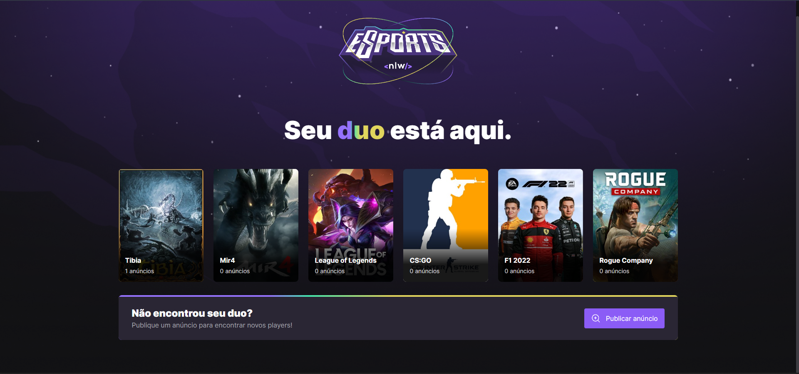
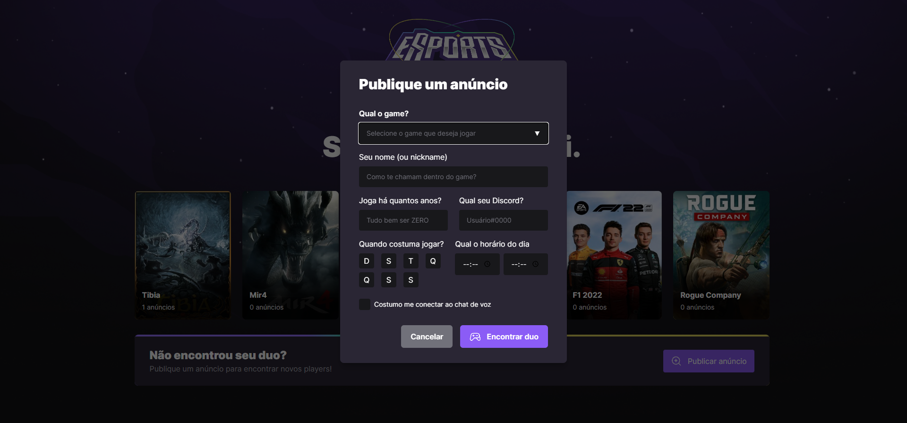
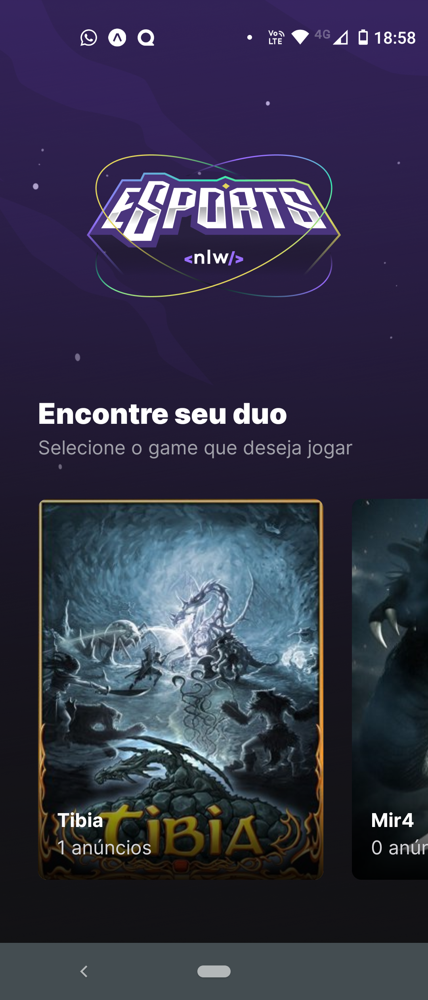
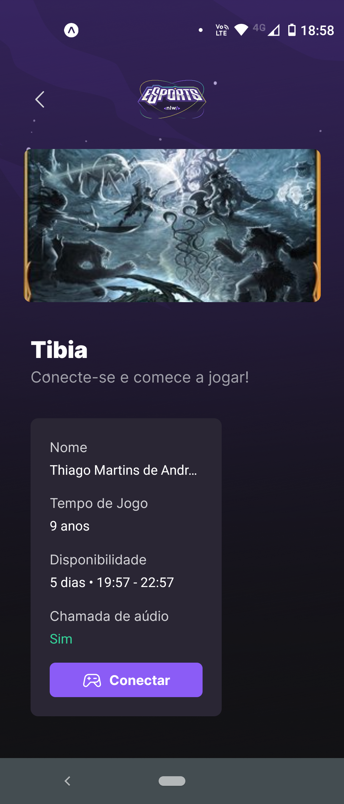
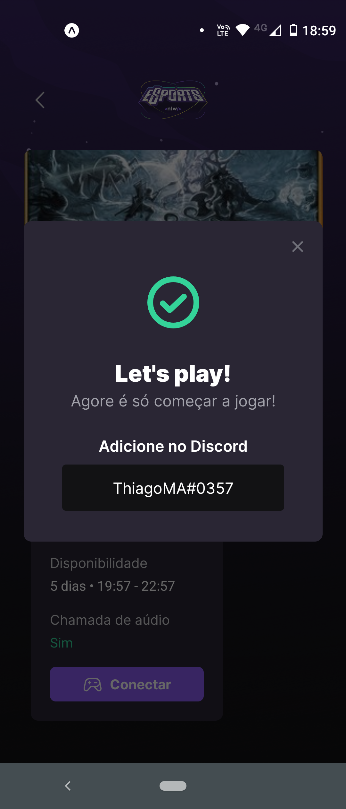

<h1 align="center">
   Aplicação
</h1>
 

 <a href="#sobre">Sobre</a> •
 <a href="#📷web">Web</a> •
 <a href="#📷mobile">Mobile</a> •
 <a href="#🚀tecnologias">Tecnologias</a>

 

## 💻 Sobre

É uma aplicação feita utilizando React + Typescript + NodeJs + React Native, aplicação da nlw especial eSports, da trilha ignite.

## 📷Web

  

  
  

 

## 📷Mobile

  
  
  
  

## 🚀Tecnologias

Esse projeto foi desenvolvido com as seguintes tecnologias:

✔️React

✔️React Native

✔️NodeJs

✔️Typescript

  
